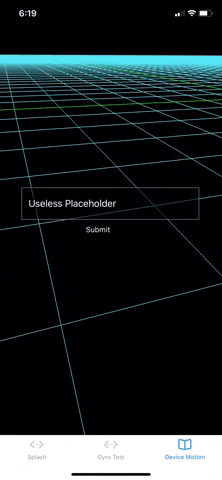

## Arcade City 3D app

#### Objectives

* Create a decentralized services marketplace for
'peer-to-peer everything'. 
* Build a [group-forming
network](https://wiki.p2pfoundation.net/Group_Forming_Networks#:~:text=First%2C%20we%20focus%20on%20the,N%2B2%2C%20etc..&text=Networks%20have%20the%20ability%20to,growth%20here%20is%20'exponential'.)
connecting individual agency with collective intelligence. 
* Borrow game dynamics like guilds, classes and levels from MMORPGs like World
  of Warcraft. 
* Appeal to mainstream consumers by providing tangible, fun, accessible real-world alternatives to existing economic models. *"Don't use Uber, find a driver in
Arcade City. Don't shop at big corporations, find a local farmer or merchant in
Arcade City. Don't prop up big academia, find an educator in Arcade City."*

#### Wiki
See [wiki](https://github.com/ArcadeCity/ac3d/wiki) for a thorough introduction
and tech stack rationale.

And see [inspiration](https://github.com/ArcadeCity/ac3d/wiki/Inspiration).

#### Tech stack

* [React Native](https://reactnative.dev/) via [Expo](https://expo.io/) ([ejected](https://docs.expo.io/bare/customizing/))
* [three.js](https://threejs.org/) and [react-three-fiber](https://github.com/react-spring/react-three-fiber)
* [zustand](https://zustand.surge.sh/) for state management
* [react-navigation](https://reactnavigation.org/) v5
* [WebRTC](https://webrtc.org/) via [react-native-webrtc](https://github.com/react-native-webrtc/react-native-webrtc) & borrowing from [jitsi-meet](https://github.com/jitsi/jitsi-meet)
* [Flow](https://www.onflow.org/) blockchain with built-in [custodial wallet](https://github.com/onflow/flow-js-sdk/blob/master/packages/fcl/src/wallet-provider-spec/custodial.md)
* Integrates our Arcade Token (Currently
  [$ARCD](https://etherscan.io/token/0xb581e3a7db80fbaa821ab39342e9cbfd2ce33c23?a=0x3b2470e99b402a333a82ee17c3244ff04c79ec6f)
  on Ethereum, soon with a 1:1 bridge to our forthcoming $ARCF token on Flow)
* Backend TBD, likely Go and/or Laravel

#### Contributing

We welcome contributions and forks. To contribute to this codebase, email
cityhall@arcade.city to get plugged in.  

Code is [licensed GPLv3](https://github.com/ArcadeCity/ac3d/blob/docs/LICENSE), meaning you can re-use our code in your own projects,
but any modifications must also be publicly available under the GPLv3.

#### Further reading

* [Foundational Principles & Technologies for the Metaverse](https://m3-org.github.io/research/sweeney.html) - Tim Sweeney,
  Founder & CEO, Epic Games - July 2019
* [Evaluating the Potential of Cooperative Ridesourcing: A Case Study of Arcade
  City in Austin, Texas](https://arcade.city/files/ArcadeCity_FinalReport.pdf) -
  Sustainable Economies Law Center - November 2019